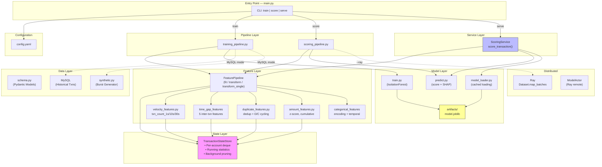
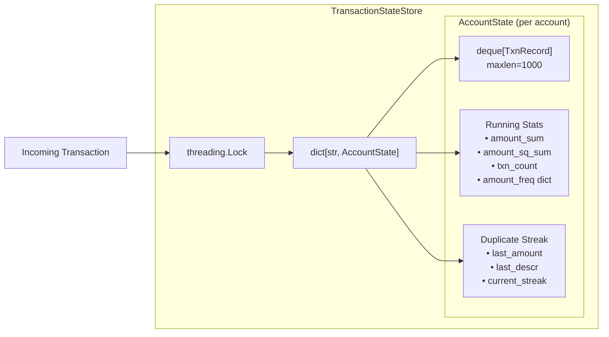
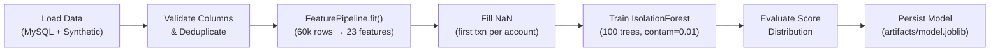
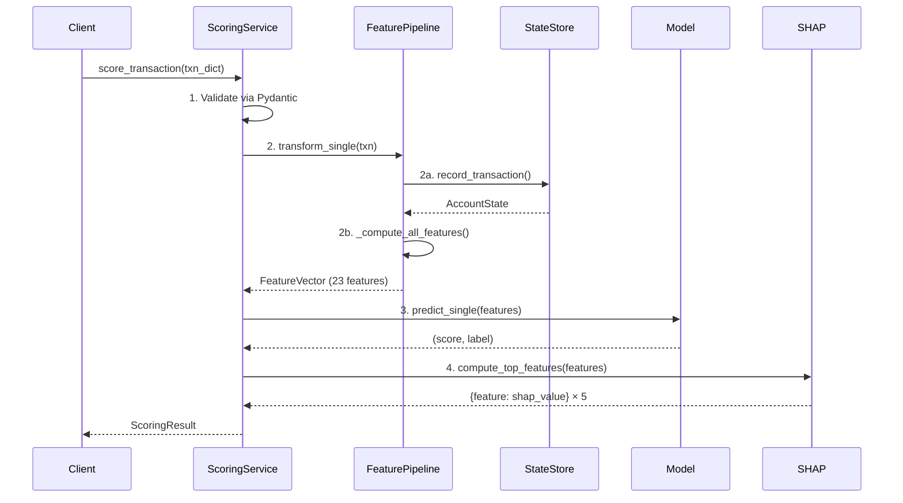
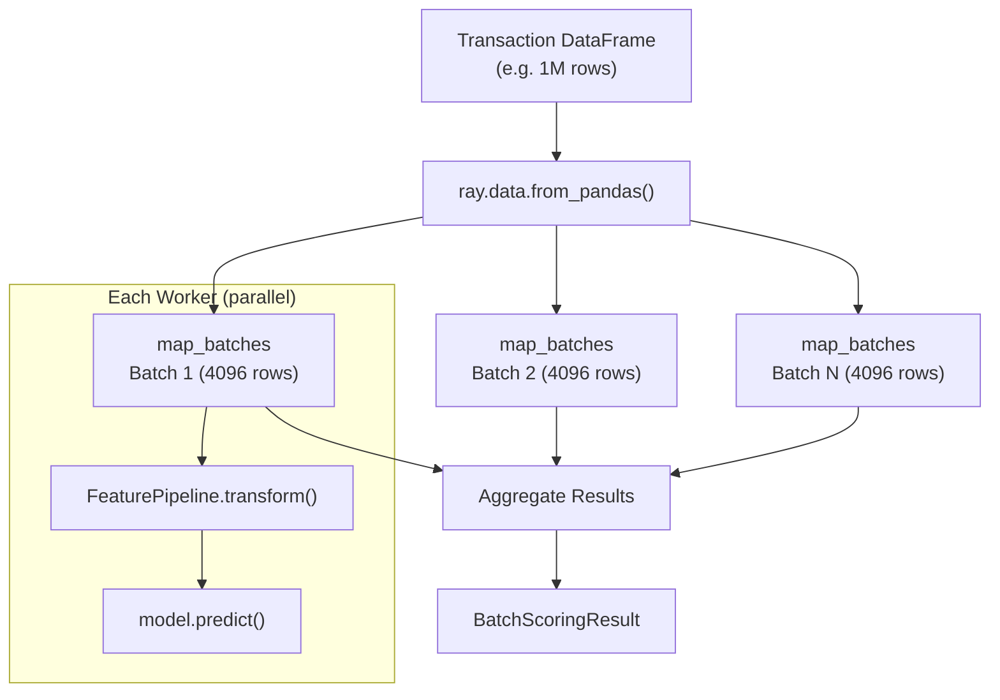
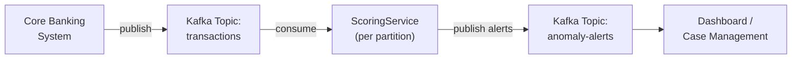
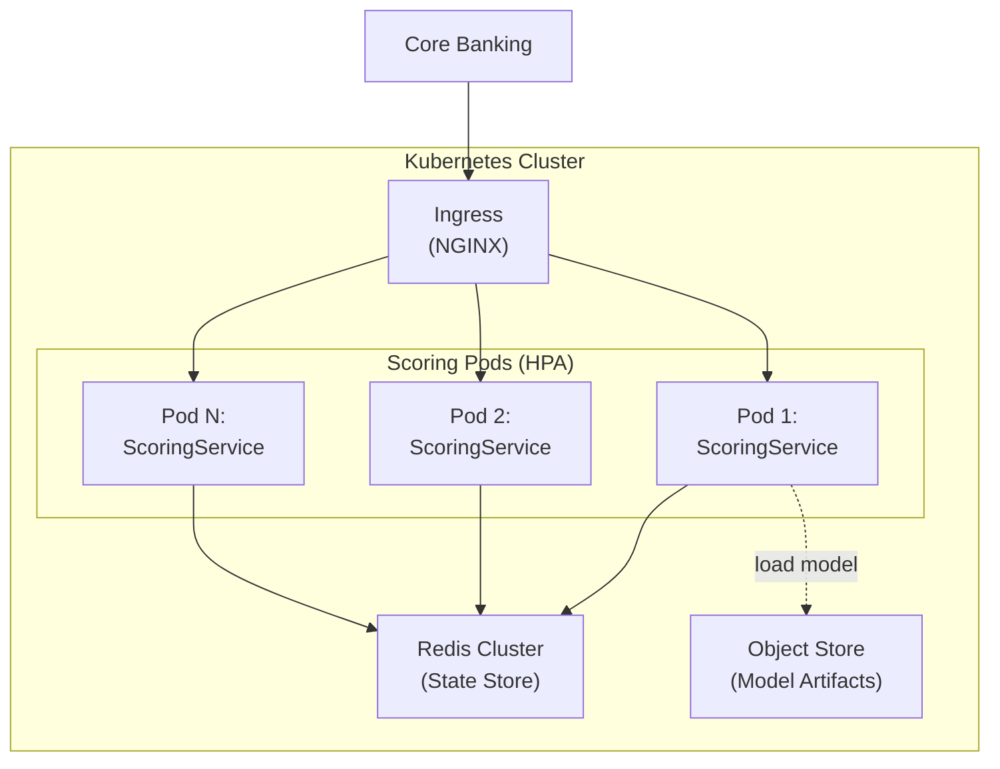

# Transaction Anomaly Detection System — Technical Documentation

> **Production-grade real-time anomaly detection for banking transaction monitoring.**
> 
> Version 1.0 · March 2026

---

## Table of Contents

1. [System Overview](#1-system-overview)
2. [System Architecture](#2-system-architecture)
3. [Data Processing Pipeline](#3-data-processing-pipeline)
4. [Stateful Feature Engine](#4-stateful-feature-engine)
5. [Feature Engineering Pipeline](#5-feature-engineering-pipeline)
6. [Machine Learning Model](#6-machine-learning-model)
7. [Model Training Pipeline](#7-model-training-pipeline)
8. [Model Prediction Pipeline](#8-model-prediction-pipeline)
9. [Real-Time Scoring Design](#9-real-time-scoring-design)
10. [Distributed Processing](#10-distributed-processing)
11. [Model Serving Design](#11-model-serving-design)
12. [Configuration Management](#12-configuration-management)
13. [Logging and Observability](#13-logging-and-observability)
14. [Production Readiness](#14-production-readiness)
15. [Future Scaling](#15-future-scaling)

---

## 1. System Overview

### Purpose

This system performs **real-time transaction anomaly detection** for a banking transaction monitoring environment. It identifies unusual patterns in financial transactions — specifically **repeated burst transactions within a short time frame** — using unsupervised machine learning, without requiring labelled fraud data.

The system is designed for operational deployment in a core banking ecosystem where transactions arrive as a continuous stream and each must be scored within milliseconds.

### High-Level Pipeline

Every transaction flows through a deterministic, five-stage pipeline:

```
Transaction Input
    → Pydantic Validation
        → Stateful Feature Engine (TransactionStateStore)
            → Feature Pipeline (23 features)
                → Isolation Forest Model
                    → Anomaly Score + SHAP Explanation
```

A raw transaction enters the system as a JSON-like dictionary. The system validates the input, updates an in-memory per-account state store, computes 23 stateful and contextual features in real time, passes the feature vector through a pre-loaded Isolation Forest model, and returns a score, a binary label, and the top-5 SHAP feature contributions — all within approximately **7–11 ms per transaction**.

### Design Goals

| Goal                             | Implementation                                                                                                                         |
| -------------------------------- | -------------------------------------------------------------------------------------------------------------------------------------- |
| **Near real-time scoring**       | In-memory state store, pre-loaded model, efficient backward scans over deque history — ~8 ms per transaction                           |
| **Scalable feature engineering** | Row-by-row stateful processing that works identically in batch (training) and real-time (serving) modes                                |
| **Modular architecture**         | Clean separation into config, data schema, state, features, model, pipeline, and service layers                                        |
| **Production-ready ML pipeline** | End-to-end train → score → serve CLI, YAML configuration, joblib persistence, SHAP explainability, Ray-based distributed batch scoring |

---

## 2. System Architecture

### Module Map

The system is organised into seven logical layers, each encapsulated in its own Python package:

| Package        | Responsibility                                                                                                |
| -------------- | ------------------------------------------------------------------------------------------------------------- |
| `config/`      | YAML-driven configuration for every tunable parameter                                                         |
| `data/`        | Pydantic schemas (`Transaction`, `FeatureVector`, `ScoringResult`) and synthetic data generation              |
| `state/`       | `TransactionStateStore` — thread-safe, in-memory sliding-window state per account                             |
| `features/`    | Feature computation modules (velocity, time-gap, duplicate, amount, categorical) unified by `FeaturePipeline` |
| `model/`       | Model training (`train.py`), prediction (`predict.py`), loading/caching (`model_loader.py`)                   |
| `pipeline/`    | Orchestration layers for training (`training_pipeline.py`) and batch scoring (`scoring_pipeline.py`)          |
| `service/`     | `ScoringService` — the production entry point for real-time single-transaction scoring                        |
| `ray_cluster/` | Ray initialisation and `ModelActor` for distributed batch processing                                          |

### Architecture Diagram



### Component Interaction Flow

1. **Configuration** is loaded once at startup and threaded through every layer — model parameters, feature column order, velocity windows, state retention, encoding maps, and Ray settings all live in a single `config.yaml`.

2. **Data schemas** enforce contracts at module boundaries. Raw input is validated through `Transaction` (Pydantic), features are typed through `FeatureVector`, and outputs are structured as `ScoringResult` — ensuring type safety from ingestion to output.

3. **The state store** is the backbone of the feature engine. Every feature module receives the `AccountState` object and scans the account's transaction history to compute features. The state store owns the data; feature modules are pure functions that read it.

4. **The feature pipeline** is the single orchestrator. It sequences the five feature groups (velocity → time-gap → duplicate → amount → categorical), aggregates them into a single dict, and returns either a DataFrame (batch) or a `FeatureVector` (real-time). Critically, the same `_compute_all_features()` method is used for both paths, guaranteeing **training–serving parity**.

5. **The model layer** is stateless. `predict_single()` and `predict_batch()` are pure functions that accept a feature vector and a model object. The model is loaded once via `model_loader.py` and cached at module level.

6. **The service layer** ties everything together for production use. `ScoringService` holds a `FeaturePipeline` (with its embedded state store), a pre-loaded model, and a pre-initialised SHAP `TreeExplainer`. A single method call — `score_transaction(txn_dict)` — performs the full pipeline.

---

## 3. Data Processing Pipeline

### Transaction Schema

Every transaction is validated through the `Transaction` Pydantic model before entering the pipeline:

| Field                   | Type       | Constraint       | Description                                                                    |
| ----------------------- | ---------- | ---------------- | ------------------------------------------------------------------------------ |
| `account_number`        | `str`      | Required         | Account identifier (string to preserve precision for 19-digit account numbers) |
| `posting_timestamp`     | `datetime` | Required         | Exact posting time                                                             |
| `transaction_ac_amount` | `float`    | `≥ 0`            | Transaction amount in account currency                                         |
| `descr`                 | `str`      | Required         | Transaction type (e.g., "Fund Transfer", "GIRO", "PayNow")                     |
| `debit_credit_code`     | `str`      | `^[DC]$` (regex) | D = Debit, C = Credit                                                          |
| `input_source`          | `str`      | Required         | Channel code: T (Teller), Z (ATM), M (Mobile), A (API)                         |

Optional passthrough fields (`business_date`, `account_type`, `status`, `bank_code`, etc.) are carried but not used in feature computation — allowing the schema to accept the full core banking payload without preprocessing.

### Input Validation

Pydantic v2 performs validation at construction time:

- **Type coercion**: Timestamps are parsed from ISO strings to `datetime` objects automatically.
- **Constraint enforcement**: `transaction_ac_amount` must be non-negative; `debit_credit_code` must match `D` or `C` exactly.
- **Fail-fast**: Invalid transactions raise a `ValidationError` before any state mutation occurs, protecting the state store from corrupted data.

### Categorical Encoding

Categorical fields are encoded to integers using **static lookup maps** defined in `config.yaml`:

| Field               | Encoding                                                              |
| ------------------- | --------------------------------------------------------------------- |
| `descr`             | ATM→0, Charges→1, Fund Transfer→2, GIRO→3, PayNow→4, Payment to IBT→5 |
| `debit_credit_code` | C→0, D→1                                                              |
| `input_source`      | A→0, M→1, T→2, Z→3                                                    |

Unknown values map to `-1`. This deterministic encoding avoids the need for a fitted encoder artifact — the same map is used in training and serving, eliminating a class of training–serving skew bugs.

### Timestamp Processing

Timestamps are converted to Unix epoch seconds (`float`) at the point of entry into the state store. All sliding-window computations (1s, 10s, 30s, 10min) operate on epoch differences, which is both fast (simple float subtraction) and timezone-agnostic.

The `hour_of_day` and `is_business_hours` features are extracted from the original `datetime` object, where `is_business_hours = 1` when `Monday–Friday` and `08:00–18:00`.

### Efficient Stream Processing

The system processes transactions **row-by-row in timestamp order** using a single forward pass:

1. For training, the DataFrame is sorted by `(account_number, posting_timestamp)` before iteration.
2. Each transaction is appended to the state store (`O(1)` deque append).
3. Features are computed by scanning backwards from the current position — only the relevant time window is touched.
4. The result array is filled incrementally.

This design avoids building large intermediate DataFrames and keeps memory proportional to the state retention window (10 minutes × accounts), not the full dataset size.

---

## 4. Stateful Feature Engine

### Role of the TransactionStateStore

The `TransactionStateStore` is the system's core data structure. It maintains a **sliding window of recent transactions per account** that enables real-time computation of velocity, duplicate, and temporal features without re-scanning the entire transaction history.

### Architecture



### Per-Account State: AccountState

Each account maintains:

| Component                                     | Data Structure                   | Purpose                                                                                                                                           |
| --------------------------------------------- | -------------------------------- | ------------------------------------------------------------------------------------------------------------------------------------------------- |
| `history`                                     | `deque[TxnRecord]` (maxlen=1000) | Sliding window of recent transactions. Bounded deque guarantees O(1) append and automatic eviction of the oldest record when capacity is reached. |
| `amount_sum`, `amount_sq_sum`, `txn_count`    | `float`, `float`, `int`          | Welford-style running statistics for computing **amount z-score** in O(1) without scanning history.                                               |
| `amount_freq`                                 | `dict[float, int]`               | Cumulative count of each exact amount for the account — used for `same_amount_frequency`.                                                         |
| `last_amount`, `last_descr`, `current_streak` | `float`, `str`, `int`            | Tracks consecutive transactions with the same amount and description for `duplicate_streak`.                                                      |

### TxnRecord

Each record in the deque is a lightweight `@dataclass(slots=True)`:

```
TxnRecord(ts: float, amount: float, descr: str, dc_sign: int, input_source: str)
```

Using `slots=True` minimises memory overhead (~64 bytes per record vs ~200+ for a regular object with `__dict__`). At 1,000 records per account and 5,000 active accounts, this consumes approximately **300 MB** of memory.

### Sliding Time Windows

Feature modules query the state store using backward scans from the current timestamp:

| Window                | Feature Examples                                                               | Implementation                                                                                         |
| --------------------- | ------------------------------------------------------------------------------ | ------------------------------------------------------------------------------------------------------ |
| **1 second**          | `txn_count_1s`                                                                 | `compute_velocity_features()` — scans backward until `delta > max_window`                              |
| **10 seconds**        | `txn_count_10s`                                                                | Same scan, counts records within each window boundary                                                  |
| **30 seconds**        | `txn_count_30s`                                                                | Same scan — single pass covers all three windows                                                       |
| **10 minutes** (600s) | `cumulative_amount_10min`, `reversal_count_10min`, `same_acct_amt_count_10min` | `compute_duplicate_features()`, `compute_amount_features()` — scan from newest, break on `ts < cutoff` |

The **key optimisation** is that all velocity windows are computed in a single backward pass through the history. The scan starts from the newest record (right end of deque) and short-circuits once it reaches a record older than the largest window:

```python
for rec in reversed(account_state.history):
    delta = current_ts - rec.ts
    if delta > max_window:
        break  # no more records can fall in any window
    for name, win_sec in windows.items():
        if delta <= win_sec:
            counts[name] += 1
```

This is **O(k)** where k is the number of records in the largest window, not O(n) over the full history.

### Thread Safety

The state store is protected by a `threading.Lock` around all mutation operations (`record_transaction`, `prune`). Read operations (`get_account_state`, `get_window`, `get_last_n`) are safe for concurrent readers because they access immutable snapshots of the deque.

### Background Pruning

A daemon thread runs every 60 seconds (configurable) to evict records older than the retention window (600 seconds). Pruning uses `deque.popleft()` which is O(1) per record. Empty accounts are removed from the dictionary to prevent memory leaks in long-running deployments.

### Features Computed from State

| Feature                                          | How It Uses State                                                 |
| ------------------------------------------------ | ----------------------------------------------------------------- |
| `txn_count_1s`, `txn_count_10s`, `txn_count_30s` | Backward scan counting records within window                      |
| `time_since_last_txn`                            | `current_ts - history[-2].ts` (the record before the current one) |
| `time_since_last_txn_same_amount`                | Backward scan for first record matching amount                    |
| `time_since_last_txn_same_descr`                 | Backward scan for first record matching descr                     |
| `avg_time_gap_last_5txn`                         | Mean of inter-arrival times from last 5 consecutive records       |
| `min_time_gap_last_10txn`                        | Minimum of inter-arrival times from last 10 consecutive records   |
| `same_acct_amt_descr_count_10min`                | 10-min window scan counting (amount, descr) matches               |
| `same_acct_amt_count_10min`                      | 10-min window scan counting amount matches                        |
| `is_exact_duplicate_10min`                       | `1` if `same_acct_amt_descr_count > 1` within 10 minutes          |
| `duplicate_streak`                               | From `AccountState.current_streak` (running tracker, O(1))        |
| `dc_sign`                                        | Current transaction's debit/credit sign (+1 / -1)                 |
| `dc_alternation_count_10txn`                     | Counts sign flips in last 10 records                              |
| `reversal_count_10min`                           | 10-min window scan for same-amount opposite-sign pairs            |
| `amount_zscore_account`                          | `(amount - mean) / std` from running Welford statistics (O(1))    |
| `same_amount_frequency`                          | From `AccountState.amount_freq` dictionary (O(1) lookup)          |
| `cumulative_amount_10min`                        | 10-min window scan summing amounts                                |

---

## 5. Feature Engineering Pipeline

### FeaturePipeline Design

The `FeaturePipeline` class is the single interface for all feature computation. It supports three modes of operation through a unified internal method:

| Method                  | Mode           | State Handling                                  | Use Case               |
| ----------------------- | -------------- | ----------------------------------------------- | ---------------------- |
| `fit(df)`               | Batch training | **Clears** state store, then processes all rows | Training pipeline      |
| `transform(df)`         | Batch scoring  | **Preserves** state (incremental)               | Batch scoring pipeline |
| `transform_single(txn)` | Real-time      | **Preserves** state (appends one record)        | ScoringService         |

All three methods internally call the same `_compute_all_features()`, ensuring that the feature values produced during training are **identical** to those produced during serving for the same transaction sequence.

### Feature Groups

The pipeline computes **23 features** organised into five groups, executed in order:

#### Group 1: Velocity Features (3 features)

Computed by `velocity_features.py`:

| Feature         | Description                                       |
| --------------- | ------------------------------------------------- |
| `txn_count_1s`  | Transactions from same account in last 1 second   |
| `txn_count_10s` | Transactions from same account in last 10 seconds |
| `txn_count_30s` | Transactions from same account in last 30 seconds |

These are the primary **burst detection signals**. A normal account has `txn_count_30s ≈ 1`; a burst anomaly may reach 15–27.

#### Group 2: Time-Gap Features (5 features)

Computed by `velocity_features.py`:

| Feature                           | Description                                              |
| --------------------------------- | -------------------------------------------------------- |
| `time_since_last_txn`             | Seconds since the account's previous transaction         |
| `time_since_last_txn_same_amount` | Seconds since last transaction with the same amount      |
| `time_since_last_txn_same_descr`  | Seconds since last transaction with the same description |
| `avg_time_gap_last_5txn`          | Mean inter-arrival time over the last 5 transactions     |
| `min_time_gap_last_10txn`         | Minimum inter-arrival time over the last 10 transactions |

These features capture the **rhythm** of an account. Burst anomalies produce near-zero time gaps.

#### Group 3: Duplicate Detection & D/C Cycling (7 features)

Computed by `duplicate_features.py`:

| Feature                           | Description                                                                   |
| --------------------------------- | ----------------------------------------------------------------------------- |
| `same_acct_amt_descr_count_10min` | Count of (same account + same amount + same description) in 10 minutes        |
| `same_acct_amt_count_10min`       | Count of (same account + same amount) in 10 minutes                           |
| `is_exact_duplicate_10min`        | Binary: 1 if an exact duplicate exists in the window                          |
| `duplicate_streak`                | Consecutive transactions with the same amount and description                 |
| `dc_sign`                         | Current transaction's sign: +1 (debit) or -1 (credit)                         |
| `dc_alternation_count_10txn`      | Number of debit↔credit sign flips in the last 10 transactions                 |
| `reversal_count_10min`            | Count of same-amount, opposite-sign pairs in 10 minutes (potential reversals) |

These features detect **structuring patterns** — repeated identical transactions or rapid debit/credit cycling that may indicate layering or reversal attacks.

#### Group 4: Amount Context (3 features)

Computed by `amount_features.py`:

| Feature                   | Description                                                                                     |
| ------------------------- | ----------------------------------------------------------------------------------------------- |
| `amount_zscore_account`   | Z-score of the current amount vs the account's historical mean/std (Welford running statistics) |
| `same_amount_frequency`   | Cumulative count of this exact amount for this account                                          |
| `cumulative_amount_10min` | Total amount transacted by this account in the last 10 minutes                                  |

`amount_zscore_account` flags transactions that are unusual **for that specific account**. `cumulative_amount_10min` captures the total exposure in the window.

#### Group 5: Categorical & Temporal (5 features)

Computed by `amount_features.py`:

| Feature                     | Description                                 |
| --------------------------- | ------------------------------------------- |
| `descr_encoded`             | Integer encoding of transaction description |
| `debit_credit_code_encoded` | Integer encoding of D/C code                |
| `input_source_encoded`      | Integer encoding of channel code            |
| `hour_of_day`               | Hour of the posting timestamp (0–23)        |
| `is_business_hours`         | Binary: 1 if Mon–Fri 08:00–18:00            |

### Training–Serving Parity

A common failure mode in ML systems is **training–serving skew**, where the feature computation differs between training and inference. This system eliminates that risk by:

1. Using the **same `_compute_all_features()` method** for all modes.
2. Using **static encoding maps** (no fitted encoders).
3. Using the **same `TransactionStateStore`** for both batch and real-time processing.
4. Processing **row-by-row in timestamp order** in both training and serving — the state accumulates identically.

---

## 6. Machine Learning Model

### Why Unsupervised Learning?

In banking transaction monitoring, **labelled fraud data is scarce and unreliable**. True anomalies are rare (< 1%), labels are often delayed by weeks, and the definition of "anomalous" evolves over time. Unsupervised anomaly detection avoids these limitations by learning the **normal transaction distribution** and flagging deviations.

### Algorithm: Isolation Forest

The system uses **Isolation Forest** (Liu et al., 2008) as its primary anomaly detection algorithm, with `LocalOutlierFactor` and `OneClassSVM` available as alternatives via configuration.

**How Isolation Forest works:**

1. Build an ensemble of 100 random isolation trees.
2. Each tree randomly selects a feature and a split value, recursively partitioning the data.
3. Anomalies are **isolated with fewer splits** (shorter path length) because they occupy sparse regions of the feature space.
4. The anomaly score is the mean path length normalised against the expected path length for a dataset of the same size.

**Key parameters:**

| Parameter       | Value            | Rationale                                                               |
| --------------- | ---------------- | ----------------------------------------------------------------------- |
| `n_estimators`  | 100              | Standard ensemble size; balances accuracy and latency                   |
| `max_samples`   | `"auto"` (= 256) | Subsampling makes each tree see a different view of the data            |
| `contamination` | 0.01             | Assumes ~1% of transactions are anomalous — sets the decision threshold |
| `random_state`  | 42               | Reproducibility                                                         |

### Anomaly Score Interpretation

- `decision_function(X)` returns a **signed score**:
  - **Positive** → normal (higher = more normal)
  - **Negative** → anomaly (lower = more anomalous)
- `predict(X)` returns **+1** (normal) or **-1** (anomaly), using the contamination-derived threshold.
- The `ScoringResult.is_anomaly` field is `True` when `label == -1`.

### SHAP Explainability

Each prediction is accompanied by the **top-5 SHAP feature contributions** computed via `shap.TreeExplainer`. SHAP (SHapley Additive exPlanations) decomposes the model's score into per-feature contributions:

- **Negative SHAP value** → feature pushes toward anomaly
- **Positive SHAP value** → feature pushes toward normal

The `TreeExplainer` is created once at service initialisation and reused for all predictions, adding approximately 3–5 ms of latency per transaction — a worthwhile tradeoff for explainability in a regulatory environment.

Example output for an anomalous transaction:

```
top features (SHAP): cumulative_amount_10min=-1.6259  |  same_acct_amt_descr_count_10min=-1.2335
                     same_acct_amt_count_10min=-0.9435  |  is_exact_duplicate_10min=-0.7622
                     reversal_count_10min=-0.6166
```

---

## 7. Model Training Pipeline

### End-to-End Workflow



### Step 1: Data Loading

The system supports three data sources:

- **CSV** (`--data file.csv`)
- **Parquet** (`--data file.parquet`)
- **MySQL** (`--data mysql`) — loads from `tbl_deposit_dat_account_history`, then generates synthetic burst anomaly data and combines both datasets.

For the MySQL path, 10,000 real banking transactions are combined with 50,000 synthetic transactions (including 1,250 burst anomalies at 2.5% rate) to produce a 60,000-row training set across 5,253 accounts.

### Step 2: Synthetic Data Generation

The `data/synthetic.py` module generates realistic burst anomalies:

- **50 burst events**, each containing **20–30 transactions** from the same account within a **1–5 minute window**.
- Transactions use log-normal amounts (`mean=7.5, sigma=0.8`) matching real banking distributions.
- Burst timestamps are randomised within the window to avoid trivially detectable uniform spacing.
- Non-burst transactions are spread across 94 days with random business-hour timestamps.

### Step 3: Feature Engineering

`FeaturePipeline.fit()` processes all 60,000 rows sequentially in timestamp order, building up the state store row-by-row and computing all 23 features. The state store is cleared before training to ensure a fresh start.

### Step 4: Model Training

`train_model()` extracts the 23 feature columns, fills remaining NaN values (first transaction per account has no time-gap features), and fits the Isolation Forest. Training on 60,000 × 23 features completes in under 1 second.

### Step 5: Evaluation

Training produces diagnostic statistics logged at INFO level:

```
Training complete — anomalies: 600 / 60000 (1.00%)
Score stats — mean=0.2269  std=0.0525  min=-0.0768  max=0.3024
```

### Step 6: Persistence

The trained model is serialised to `artifacts/model.joblib` using joblib's compressed pickling. The file is approximately 5 MB and loads in under 100 ms.

### CLI Command

```bash
python main.py train --data mysql
python main.py train --data transactions.csv
```

---

## 8. Model Prediction Pipeline

### Single-Transaction Scoring (`score_transaction`)

The `ScoringService.score_transaction()` method is the production entry point:



**Steps in detail:**

1. **Validate**: `Transaction(**txn_dict)` — Pydantic validates types, constraints, and coerces timestamps. Invalid input raises an exception before any state mutation.

2. **Feature computation**: `transform_single(txn)` appends a `TxnRecord` to the state store, then calls `_compute_all_features()` which invokes all five feature modules against the account's updated state.

3. **Model prediction**: `predict_single(model, features_list)` converts the feature list to a numpy array, applies `nan_to_num`, and calls `decision_function()` and `predict()` on the pre-loaded model.

4. **SHAP explanation**: `compute_top_features()` uses the pre-initialised `TreeExplainer` to compute SHAP values, then returns the top 5 by absolute value.

5. **Result assembly**: All outputs are packaged into a typed `ScoringResult` Pydantic model.

### Model Loading Strategy

The model is loaded **once** at service initialisation via `model_loader.py`, which uses a **module-level cache**:

```python
_cached_model: Any | None = None
_cached_path: str | None = None
```

Subsequent calls to `load_model()` with the same path return the cached object with zero I/O. The `force_reload` flag is available for model hot-swapping.

---

## 9. Real-Time Scoring Design

### Latency Architecture

The system achieves **~8 ms per transaction** through four design decisions:

| Technique              | Impact                     | Detail                                                                                                      |
| ---------------------- | -------------------------- | ----------------------------------------------------------------------------------------------------------- |
| **In-memory state**    | Eliminates I/O             | All account history is held in Python dictionaries with deque buffers — no database round-trips             |
| **Pre-loaded model**   | Eliminates deserialisation | Model is loaded once into memory at service startup via `model_loader.py`                                   |
| **Efficient scans**    | O(k) not O(n)              | Backward scans short-circuit once past the window boundary; velocity features are computed in a single pass |
| **O(1) running stats** | Eliminates recalculation   | Amount z-score uses Welford's algorithm; duplicate streak and amount frequency use running counters         |

### Latency Breakdown (observed, typical)

| Stage                                 | Time         |
| ------------------------------------- | ------------ |
| Pydantic validation                   | ~0.1 ms      |
| State store append                    | ~0.01 ms     |
| Feature computation (5 groups)        | ~1.5 ms      |
| Model `decision_function` + `predict` | ~0.5 ms      |
| SHAP `TreeExplainer.shap_values`      | ~4 ms        |
| Result assembly                       | ~0.1 ms      |
| **Total**                             | **~7–11 ms** |

### Memory Footprint

| Component                                    | Estimated Size |
| -------------------------------------------- | -------------- |
| Model (100 trees)                            | ~5 MB          |
| SHAP TreeExplainer                           | ~5 MB          |
| State store (5,000 accounts × 1,000 records) | ~300 MB        |
| Python overhead                              | ~50 MB         |
| **Total**                                    | **~360 MB**    |

### Avoiding Heavy Recomputation

- **No DataFrame operations in real-time**: `transform_single()` operates entirely on Python objects and the state store's deque.
- **No re-sorting**: Transactions arrive in order; the state store's deque maintains insertion order.
- **No batch recalculation**: Each feature is computed incrementally from the account's current state — only the relevant window is scanned.

---

## 10. Distributed Processing

### Ray Integration

The system uses **Ray** for distributed batch scoring when processing large transaction datasets. Ray is an optional dependency — the system falls back to sequential processing when Ray is unavailable.

### Architecture



### How Ray Improves Throughput

1. **Parallel feature engineering**: `Dataset.map_batches()` distributes DataFrame chunks across multiple workers. Each worker instantiates its own `FeaturePipeline` and state store.

2. **Zero-copy model sharing**: The trained model is placed in Ray's shared object store via `ray.put(model)`. Workers access it via `ray.get(model_ref)` without serialisation overhead.

3. **Configurable parallelism**: Batch size (default 4,096 rows) and number of workers (default 4) are configurable via `config.yaml`.

### Ray ModelActor

For high-throughput deployment, the system provides a `ModelActor` — a Ray remote actor that holds the model in shared memory and exposes `predict()` and `predict_batch()` methods for remote invocation:

```python
actor = create_model_actor(config)
score, label = ray.get(actor.predict.remote(feature_vector))
```

### CLI Usage

```bash
python main.py score --data transactions.csv --ray
```

---

## 11. Model Serving Design

### ScoringService: The Production Interface

The `ScoringService` class is designed as the integration point for production deployment:

```python
from service.scoring_service import ScoringService

service = ScoringService(config)
result = service.score_transaction({
    "account_number": "1000000000000000042",
    "posting_timestamp": "2026-03-16T14:30:00",
    "transaction_ac_amount": 50000.00,
    "descr": "Fund Transfer",
    "debit_credit_code": "D",
    "input_source": "T",
})

print(result.anomaly_score)   # -0.0089
print(result.is_anomaly)      # True
print(result.top_features)    # {'cumulative_amount_10min': -1.6259, ...}
```

### Integration Patterns

The `ScoringService` is framework-agnostic. It can be wrapped by any serving layer:

#### FastAPI

```python
from fastapi import FastAPI
app = FastAPI()
service = ScoringService(config)

@app.post("/score")
async def score(txn: dict):
    result = service.score_transaction(txn)
    return result.model_dump()
```

#### Ray Serve

```python
from ray import serve

@serve.deployment
class AnomalyDetector:
    def __init__(self):
        self.service = ScoringService(config)

    async def __call__(self, request):
        txn = await request.json()
        return self.service.score_transaction(txn).model_dump()
```

#### Event Streaming (Kafka)

```python
from kafka import KafkaConsumer, KafkaProducer

consumer = KafkaConsumer("transactions")
producer = KafkaProducer()
service = ScoringService(config)

for msg in consumer:
    txn = json.loads(msg.value)
    result = service.score_transaction(txn)
    if result.is_anomaly:
        producer.send("alerts", json.dumps(result.model_dump()))
```

### Response Schema

Every `ScoringResult` includes:

| Field                   | Type               | Description                       |
| ----------------------- | ------------------ | --------------------------------- |
| `account_number`        | `str`              | Account that was scored           |
| `posting_timestamp`     | `datetime`         | Transaction timestamp             |
| `transaction_ac_amount` | `float`            | Transaction amount                |
| `anomaly_score`         | `float`            | Signed score (negative = anomaly) |
| `anomaly_label`         | `int`              | -1 (anomaly) or +1 (normal)       |
| `is_anomaly`            | `bool`             | Convenience flag                  |
| `top_features`          | `dict[str, float]` | Top-5 SHAP feature contributions  |

---

## 12. Configuration Management

### config.yaml

All tunable parameters are centralised in a single YAML file. The system reads this file once at startup and threads the config dictionary through every component.

### Configuration Sections

| Section            | Parameters                                                                              | Description                                                                                                     |
| ------------------ | --------------------------------------------------------------------------------------- | --------------------------------------------------------------------------------------------------------------- |
| `model`            | `type`, `path`, `params` (per algorithm)                                                | Model algorithm selection and hyperparameters. Supports `IsolationForest`, `LocalOutlierFactor`, `OneClassSVM`. |
| `feature_columns`  | Ordered list of 23 feature names                                                        | Defines the feature vector order. Must match between training and serving.                                      |
| `velocity_windows` | `txn_count_1s: 1`, `txn_count_10s: 10`, `txn_count_30s: 30`                             | Sliding window sizes in seconds for velocity features.                                                          |
| `state`            | `retention_seconds: 600`, `max_history_per_account: 1000`, `prune_interval_seconds: 60` | State store memory management.                                                                                  |
| `ray`              | `num_cpus`, `batch_size: 4096`, `num_workers: 4`                                        | Ray distributed processing configuration.                                                                       |
| `encoding`         | Static maps for `descr`, `debit_credit_code`, `input_source`                            | Categorical encoding (deterministic, no fitted encoder).                                                        |
| `logging`          | `level`, `format`                                                                       | Standard Python logging configuration.                                                                          |
| `synthetic_data`   | `n_rows`, `n_accounts`, `anomaly_rate`, burst parameters, `seed`                        | Synthetic data generation parameters for the MySQL training path.                                               |
| `database`         | `host`, `user`, `password`, `database`, `query`                                         | MySQL connection details and SQL query for loading historical transactions.                                     |

### Design Benefits

- **Single source of truth**: No hardcoded constants scattered across modules.
- **Environment-specific overrides**: Swap config files for dev/staging/prod.
- **Reproducibility**: `random_state` and `seed` ensure identical results across runs.
- **No code changes for tuning**: Adjust contamination, window sizes, or batch sizes without modifying Python code.

---

## 13. Logging and Observability

### Logging Framework

The system uses Python's built-in `logging` module configured via `config.yaml`:

```
Format: %(asctime)s | %(name)-28s | %(levelname)-5s | %(message)s
Level: INFO (configurable)
```

Each module creates a named logger (`logging.getLogger(__name__)`) enabling fine-grained control over log levels.

### Events Logged

#### Training Pipeline

| Event                | Level | Example                                                           |
| -------------------- | ----- | ----------------------------------------------------------------- |
| Data loading         | INFO  | `Loaded 60000 rows from mysql`                                    |
| Synthetic generation | INFO  | `Synthetic data generated: 50000 rows \| anomalies: 1250 (2.50%)` |
| Feature progress     | INFO  | `processed 10000 / 60000 rows` (every 10k)                        |
| Feature complete     | INFO  | `FeaturePipeline.fit complete — shape (60000, 24)`                |
| Training result      | INFO  | `Training complete — anomalies: 600 / 60000 (1.00%)`              |
| Score statistics     | INFO  | `Score stats — mean=0.2269 std=0.0525 min=-0.0768 max=0.3024`     |
| Model persistence    | INFO  | `Model saved to artifacts/model.joblib`                           |

#### Real-Time Scoring

| Event                     | Level       | Trigger                                                                       |
| ------------------------- | ----------- | ----------------------------------------------------------------------------- |
| Normal transaction scored | DEBUG       | Every normal transaction (suppressed at INFO)                                 |
| **Anomaly detected**      | **WARNING** | Every anomalous transaction — includes account, amount, score, label, latency |
| Service init              | INFO        | `ScoringService initialised — model=IsolationForest, features=23`             |
| SHAP explainer init       | INFO        | `SHAP TreeExplainer created for IsolationForest`                              |
| Background pruning        | INFO        | Thread start/stop                                                             |
| Pruning events            | DEBUG       | `Pruned N expired records from state store`                                   |
| Service shutdown          | INFO        | `ScoringService shut down`                                                    |

#### Batch Scoring

| Event            | Level | Example                                                   |
| ---------------- | ----- | --------------------------------------------------------- |
| Batch prediction | INFO  | `Batch prediction — 60000 samples, 600 anomalies (1.00%)` |
| Ray init         | INFO  | `Initialising Ray with 8 CPUs`                            |

### Observability Design

- **Anomalies use WARNING level**: Anomalous transactions are automatically elevated to `WARNING`, making them visible in log aggregation systems (e.g., ELK, CloudWatch) without custom filters.
- **Latency tracking**: Every `score_transaction()` call measures elapsed time via `time.perf_counter()` and logs it with the result.
- **State diagnostics**: `service.state_stats` exposes `accounts_tracked` and `total_records` for monitoring memory pressure.

---

## 14. Production Readiness

### Assessment Summary

| Criterion                     | Status | Evidence                                                                                       |
| ----------------------------- | ------ | ---------------------------------------------------------------------------------------------- |
| **Modular architecture**      | ✅      | 7 packages with clear single responsibilities; no circular dependencies                        |
| **Separation of concerns**    | ✅      | State, features, model, pipeline, and service layers are independently testable                |
| **Type safety**               | ✅      | Pydantic validation on all inputs/outputs; typed feature vectors                               |
| **Training–serving parity**   | ✅      | Same `_compute_all_features()` for training and inference                                      |
| **Efficient data structures** | ✅      | Bounded deque (O(1) append), Welford running stats (O(1) z-score), backward-scan short-circuit |
| **Thread safety**             | ✅      | `threading.Lock` on state mutations; daemon pruning thread                                     |
| **Memory management**         | ✅      | Bounded deque maxlen, background pruning, empty-account eviction                               |
| **Distributed processing**    | ✅      | Ray `Dataset.map_batches` for batch; `ModelActor` for remote serving                           |
| **Explainability**            | ✅      | Per-transaction SHAP values via `TreeExplainer`                                                |
| **Configuration-driven**      | ✅      | All parameters in YAML; no hardcoded constants                                                 |
| **Model persistence**         | ✅      | joblib serialisation with module-level caching on load                                         |
| **Graceful shutdown**         | ✅      | `service.shutdown()` stops pruning thread; `shutdown_ray()` for Ray cleanup                    |
| **Error handling**            | ✅      | Pruning thread catches exceptions; state store handles missing accounts defensively            |
| **Reproducibility**           | ✅      | `random_state=42`, `seed=42` for synthetic data                                                |
| **CLI interface**             | ✅      | `train`, `score`, `serve` subcommands with `argparse`                                          |

### What Makes This Production-Grade

1. **Zero training–serving skew**: The identical feature computation code path is used everywhere. There are no separate "offline feature store" and "online feature server" implementations that can drift apart.

2. **Bounded resource usage**: The state store has hard limits (`max_history_per_account=1000`), automatic pruning, and empty-account eviction. Memory is proportional to active accounts, not total transaction volume.

3. **Low-latency by design**: The ~8 ms scoring latency is dominated by SHAP computation (optional). The core score is ~3 ms. This is fast enough for synchronous transaction screening.

4. **Horizontally scalable**: The Ray integration enables distributing batch workloads across multiple CPUs or machines. The `ScoringService` is stateless except for the state store, which can be replaced with Redis for multi-instance deployments.

---

## 15. Future Scaling

### Kafka Transaction Streams

Replace the demo transaction loop with a Kafka consumer for production transaction ingestion:



- **Partitioning by account_number** ensures all transactions for an account arrive at the same consumer, maintaining state store consistency.
- Multiple consumers can scale horizontally by partition.

### Redis State Store

Replace the in-memory `TransactionStateStore` with a Redis-backed implementation:

| Feature          | Current (In-Memory)            | Future (Redis)                |
| ---------------- | ------------------------------ | ----------------------------- |
| Persistence      | Process-local, lost on restart | Persistent across restarts    |
| Multi-instance   | Not supported                  | Shared state across instances |
| Memory limit     | Process memory                 | Redis cluster memory          |
| Latency overhead | ~0 ms                          | ~0.5–1 ms per operation       |

The interface (`record_transaction`, `get_account_state`, `get_window`) is abstracted behind `TransactionStateStore`, making the Redis swap a single module replacement.

### Ray Serve

Deploy the `ScoringService` as a Ray Serve deployment for autoscaling:

```python
@serve.deployment(
    num_replicas=4,
    ray_actor_options={"num_cpus": 1},
    autoscaling_config={"min_replicas": 2, "max_replicas": 16},
)
class AnomalyDetector:
    def __init__(self):
        self.service = ScoringService(config)
    ...
```

Ray Serve provides HTTP ingress, request batching, and automatic replica scaling based on queue depth.

### Kubernetes Deployment



- **Horizontal Pod Autoscaler (HPA)** scales pods based on CPU or request latency.
- **Model artifacts** are loaded from object storage (S3/GCS) at pod startup.
- **Redis** provides shared state across all pods.
- **Health checks**: Add `/health` and `/ready` endpoints to the FastAPI wrapper.

### Model Retraining Pipeline

For continuous improvement:

1. **Scheduled retraining**: Cron job runs `python main.py train --data mysql` on new data.
2. **A/B testing**: Deploy new model alongside the existing one; compare anomaly rates.
3. **Model registry**: Version models in MLflow or a similar registry.
4. **Shadow scoring**: Score with the new model in parallel without alerting; compare results.

---

## Appendix: Project Structure

```
project/
├── main.py                          # CLI entry point (train / score / serve)
├── config/
│   └── config.yaml                  # All configuration parameters
├── data/
│   ├── schema.py                    # Pydantic models (Transaction, FeatureVector, ScoringResult)
│   └── synthetic.py                 # Burst anomaly data generator
├── state/
│   └── transaction_state_store.py   # In-memory sliding-window state store
├── features/
│   ├── feature_pipeline.py          # Unified feature orchestrator (fit/transform/transform_single)
│   ├── velocity_features.py         # txn_count_1s/10s/30s + time-gap features
│   ├── duplicate_features.py        # Duplicate detection + D/C cycling features
│   └── amount_features.py           # Amount z-score, cumulative, categorical encoding
├── model/
│   ├── train.py                     # Model training (IsolationForest / LOF / OneClassSVM)
│   ├── predict.py                   # Prediction + SHAP TreeExplainer
│   └── model_loader.py             # Cached model loading
├── pipeline/
│   ├── training_pipeline.py         # End-to-end training orchestration
│   └── scoring_pipeline.py          # Batch scoring (sequential + Ray)
├── service/
│   └── scoring_service.py           # Real-time scoring service
├── ray_cluster/
│   └── ray_config.py                # Ray initialisation + ModelActor
└── artifacts/
    └── model.joblib                 # Persisted trained model
```

---

## Appendix: Quick Start

```bash
# Train from MySQL + synthetic data
python main.py train --data mysql

# Batch score a CSV file
python main.py score --data transactions.csv

# Batch score with Ray distributed processing
python main.py score --data transactions.csv --ray

# Run real-time scoring demo
python main.py serve
```
